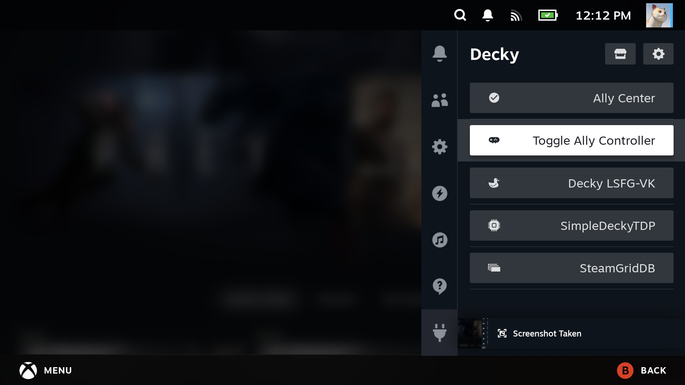
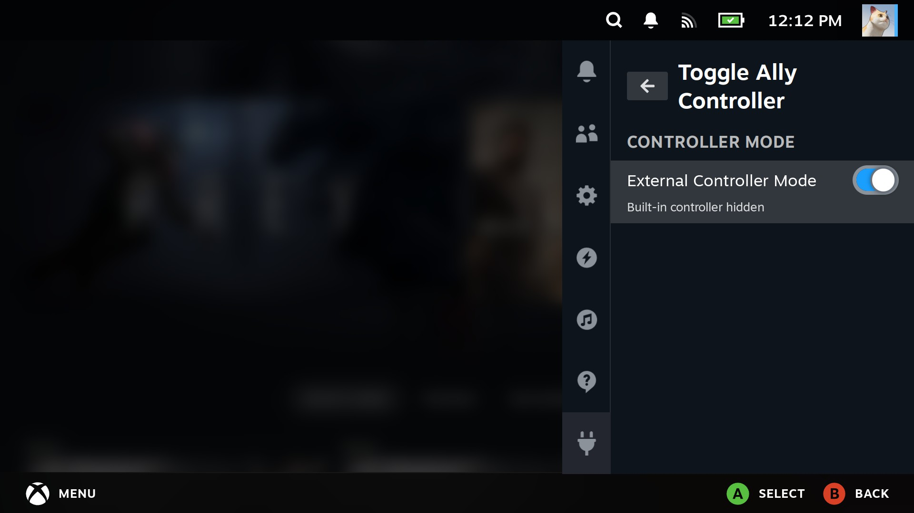

# Decky Disable Integrated ROG Ally Controller

A **Decky Loader plugin** for the Steam Deck (and ROG Ally) that allows disabling the integrated controller.  
This is useful when an external controller conflicts with the built-in controls or is not detected correctly in certain games.

---

## Features

- Disable the integrated ROG Ally / Steam Deck controller
- Prevent input conflicts with external controllers
- Lightweight plugin with minimal dependencies
- Works seamlessly with Decky Loader

---

## Installation

1. In Desktop mode download the latest release zip from [here](https://github.com/darymhurst/decky-disable-integrated-rog-ally-controller/raw/refs/heads/main/decky-disable-integrated-rog-ally-controller.zip).
2. Manually upload the zip file from within Decky after enabling developer mode.

## Notes

When the integrated controller is disabled the Armoury Crate button will be disabled which means you will need to use the alternative Power+A combination to access the Decky sidebar and then enable the controller within the plugin.
Most external controllers e.g. Xbox usually have their middle Xbox button mapped to mimic the Armoury Crate hardware button.

Note that in order to disable the integrated controller the plugin stops the `steamos-manager` service which controls:
* TDP limit management (but SimpleDeckyTDP handles this anyway)
* Battery charge limit
* Factory reset functionality
* BIOS/dock firmware updates
* Storage formatting
* Fan control (but jupiter-fan-control handles this separately)
* ds-inhibitor (DualSense inhibitor)
* WiFi management

However I have not observed any side-effects from this, certainly TDP still works via SimpleDeckyTDP and WiFi also continues to work. I would suggest re-enabling the external controller temporarily if any other settings stop working as expected but the plugin is use at your own risk, it will not delete or lose any underlying config files, it just enables/disables various services and settings, see [main.py](main.py) for details.

## Disclaimer

Only tested on Rog Ally Extreme Z1 with an external 8BitDo Ultimate 2C controller but the plugin is not hard-coded for this controller and simply focuses on disabling the integrated controller so the remaining (external) controller is the only one seen by games, in other words it should work for other controllers and also should work for newer versions e.g. Ally X.

## Appearance

